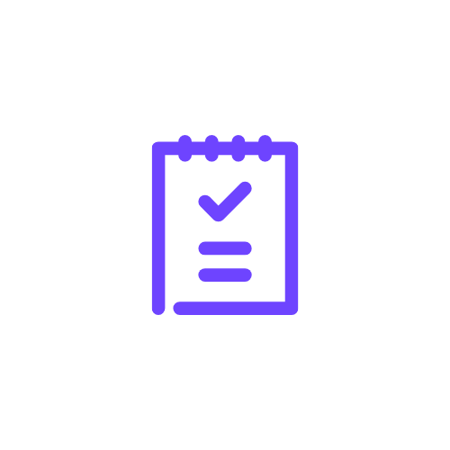
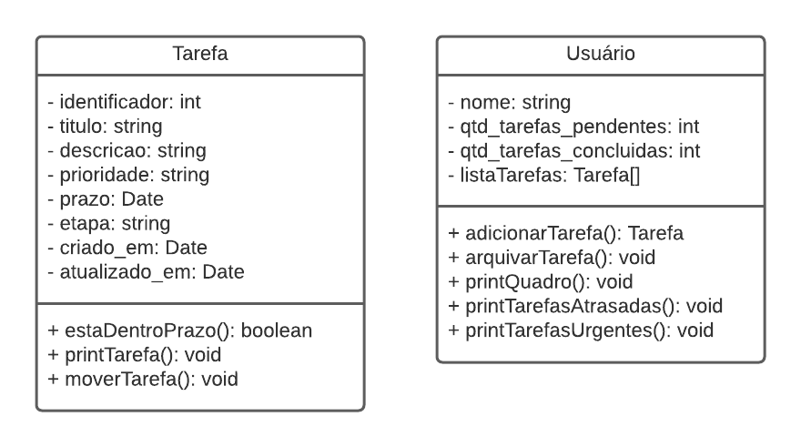

    

<h3 align="center">
    DoList
</h3>

    
    
    
    

<h4 align="center">
	✔️ Finished ✔️
</h4>

## 💻 Overview
Em um mundo tão dinâmico e competitivo, a organização pessoal é algo essencial para a busca de melhores resultados, sejam eles na vida profissional ou pessoal. Muitas pessoas sentem que o dia precisava ter mais do que 24 horas, para ser possível realizar tudo que gostariam. Entretanto, em muitos casos o problema não é a falta de tempo para fazer o que deveria ser feito, e sim a falta da gestão do tempo.

Para mudar essa situação, o primeiro passo é listar tudo que você precisa fazer e depois indicar as prioridades e os prazos, de forma que seja possível definir visualmente por onde começar. Sabendo tudo que precisa ser feito, fica mais fácil se planejar e executar as tarefas. 

A satisfação em ver as tarefas avançando entre as etapas e a visualização da lista de tarefas concluídas serve de motivação para que a pessoa mantenha o esforço de se organizar, além disso, ela terá os resultados obtidos pela conclusão das suas tarefas.
Sendo assim, a ferramenta "DoList" busca auxiliar o usuário no seu planejamento de atividades, utilizando o Sistema Kanban, onde são inseridas as atividades e sendo possível acompanha-las entre as etapas: "Planejadas", "Em andamento" e "Finalizadas".

---

## ✅ Steps
- [x] Descrição do projeto
    - [x] Detalhamento do problema e solução apresentada.
    - [x] Definição das classes e métodos que deverão ser desenvolvidos.
- [X] Desenvolver Classe "TAREFA"
    - [X] Criar atributos, conforme modelo UML.
    - [X] Criar métodos, conforme modelo UML.
- [X] Desenvolver Classe "USUÁRIO"
    - [X] Criar atributos, conforme modelo UML.
    - [X] Criar métodos, conforme modelo UML.
- [X] Gerar ID sequencial automaticamente ao criar tarefa
- [X] Implementar a interação com o usuário via linha de comando
- [X] Implementar a persistência de dados
- [X] Testes manuais do sistema
    - [X] Criação de tarefa
    - [X] Mover tarefa
    - [X] Arquivar tarefa
    - [X] Visualizar quadro
    - [X] Visualizar tarefas urgentes
    - [X] Visualizar tarefas atrasadas
    - [X] Encerrar o programa
    - [X] Persistência de dados
- [X] Gravar vídeo do funcionamento do sistema

    
    <legend align="center">Diagrama UML</legend>

---

## ⚙️ How it works

...

## 🚀 Tech Stack

-   **[C#](https://docs.microsoft.com/pt-br/dotnet/csharp/)**

#### **Utilitários**

-   IDE:  **[Visual Studio](https://visualstudio.microsoft.com/pt-br/)**

---

## Authors
<table>
    <tr>
    <td align="center">
        

            <a href="#">
                
                 
                <b>Kassia Fraga</b></a>
             

 

        

    </td>
        <td align="center">
            

                <a href="#">
                    
                     
                    <b>Vanessa Machado</b></a>
                 

 

            

        </td>
    </tr>
</table>

---

## 📝 Licença

Este projeto esta sob a licença [MIT](./LICENSE).